# 2.3 JPA with MongoDB
Create a Spring Boot Application that connects with MongoDB.

## Part 1: Basic Mongo DB configuration and Spring Boot Integration
1. Create a MongoDB Atlas account on [https://www.mongodb.com/atlas-signup-from-mlab](https://www.mongodb.com/atlas-signup-from-mlab):

    * Select the free tier:
        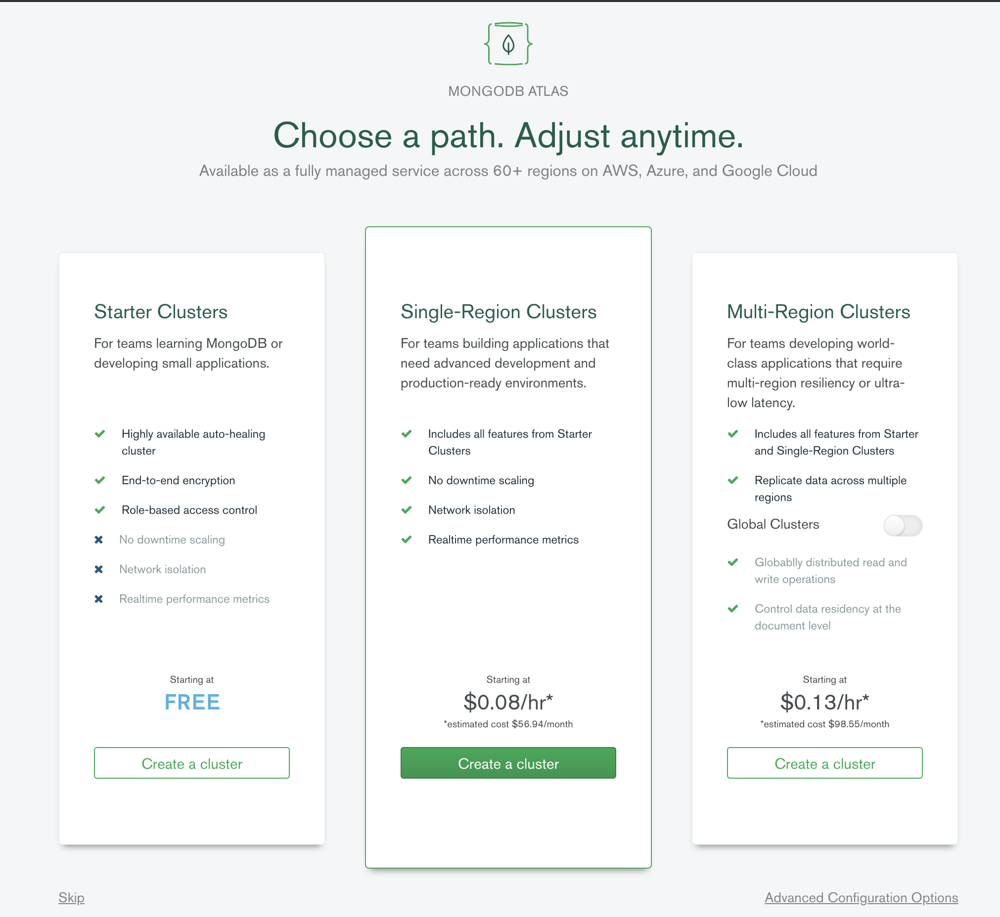

2. Configure the MongoDB Cluster:
 
    * Create a new Starter Cluster (free) using any Cloud Provider and Region
   
        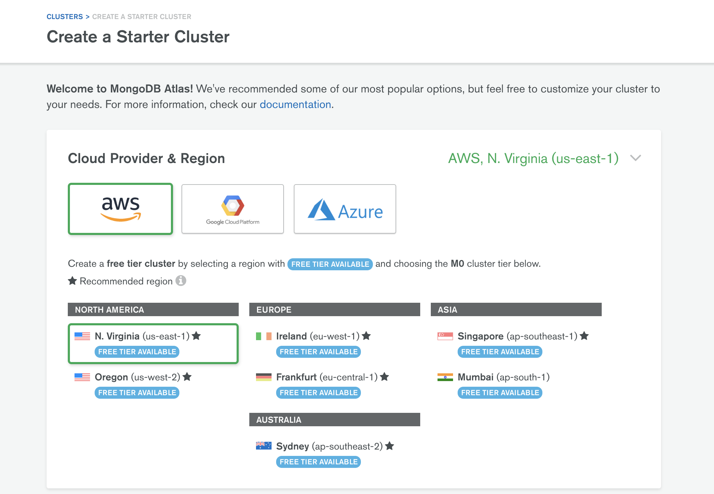

     * Scroll down to _Cluster Name_ and give the cluster a name. Click on *Create Cluster*

        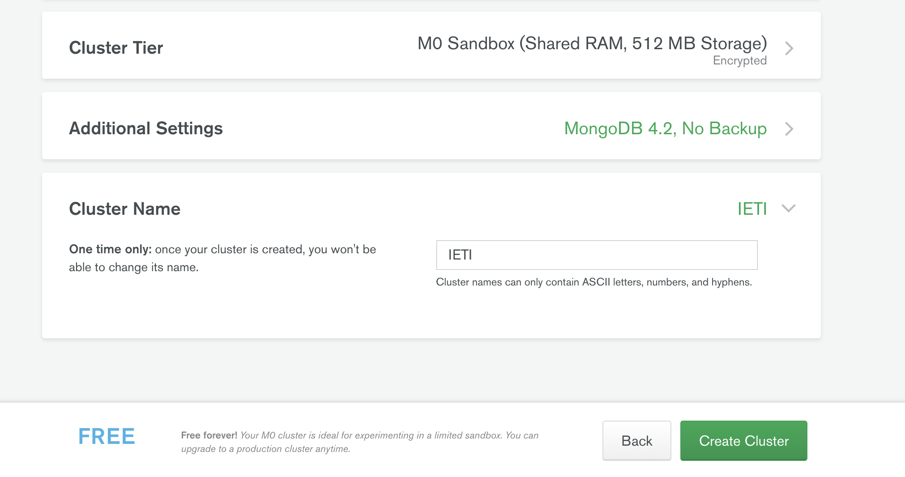

    * Wait until the cluster is provisioned and gets ready

        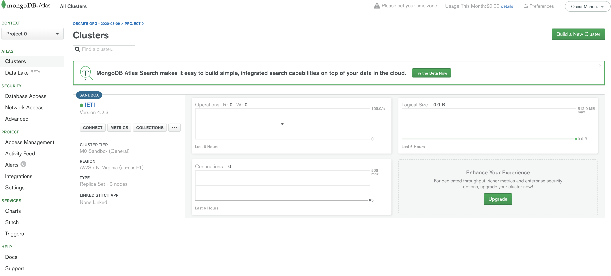   

    * Go to Database Access menu on the left panel and create a user and a password for connecting to the DB
    
        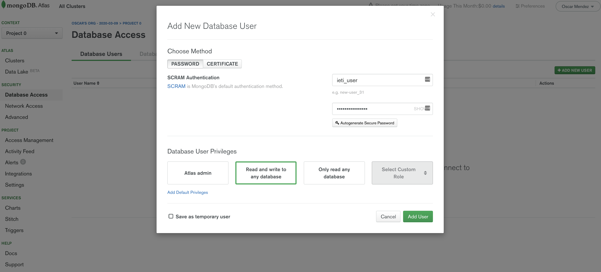
        
    * Go to Network Access on the left panel and add your IP so that it lets the application connect from your current IP address
    
        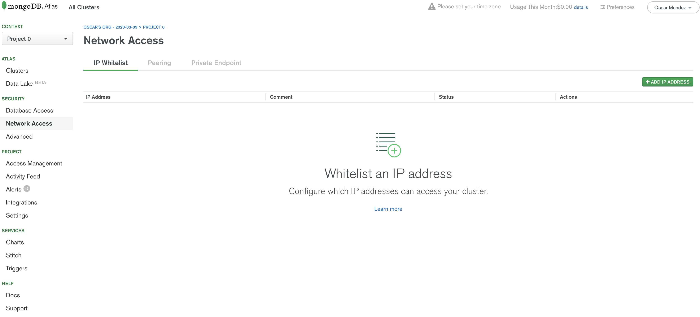

        
        
    * Go to the cluster menu on the left panel and click on the _Connect_ button
    
        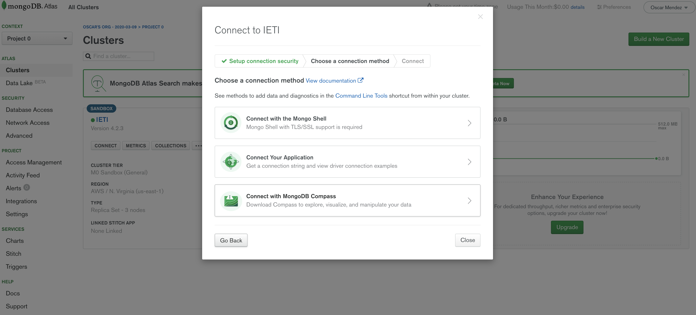
        
    * Select the option *Connect Your Application* and then copy the connection string. Before using it, replace the \<password\> placeholder with the password of the user you created previously.
        
        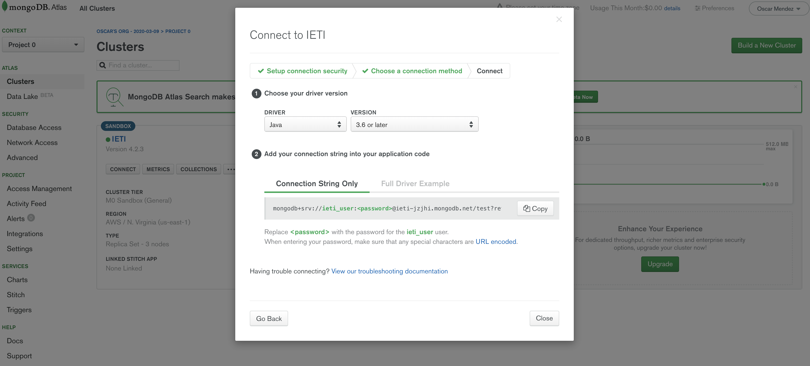
        
        
         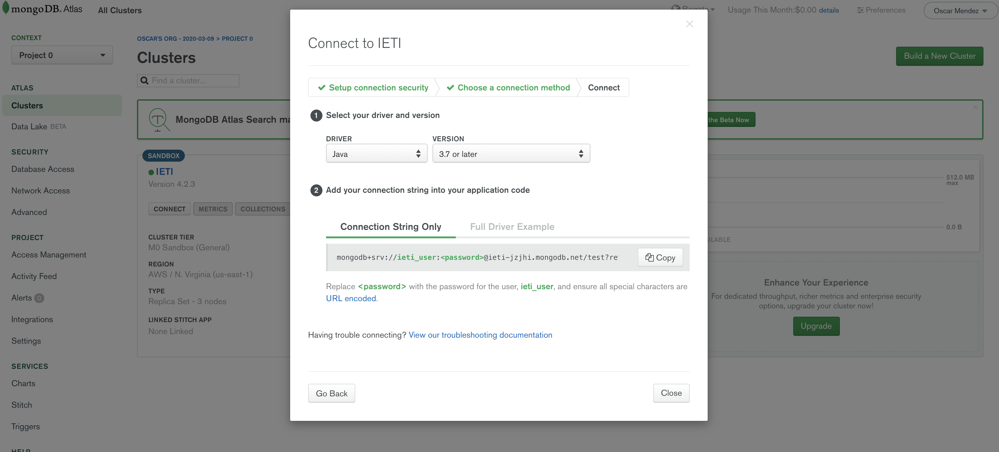
        
        
3. Clone this repo.

4. Create a new file in the root folder named *application.yml*.

5. Copy the following contents and replace the connection string placeholder with the value you got in the previous step. 

    ``` yaml
    spring:
      data:
        mongodb:
          uri: <CONNECTION_STRING> 
    ```

6. Run the project and verify that the connection to the database works properly. Answer the following questions:

- How many customers were created in the database?

    5 Customers were created in the database when the application started. 
    
    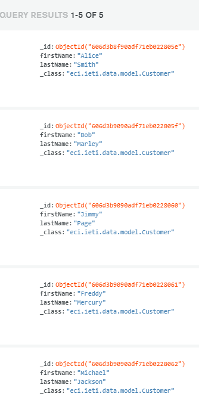

- Where is the *findAll* method implemented?
    
    The findAll method is a method included in the ***MongoRepository interface***, which is implemented
    by the [CustomerRepository](src/main/java/eci/ieti/data/CustomerRepository.java).
    
    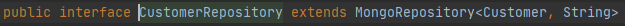

- Suppose you have more than 1000 products in your database. How would you implement a method for supporting pagination and return pages of 50 products to your frontend?

    A simple an included solution would be the pagination support for MongoRepository.
    
    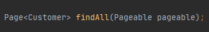
    
    A simple example for a 50 elements pagination.
    
    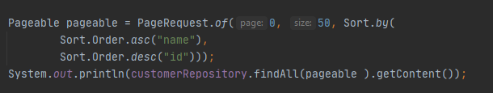

- How many products contain the "plus" word in their description?

    Exactly 4 Products
    
    ```
        Product [id=2, name=Samsung S8 plus, description=All new mobile phone Samsung S8 plus]
        Product [id=4, name=Samsung S9 plus, description=All new mobile phone Samsung S9 plus]
        Product [id=6, name=Samsung S10 plus, description=All new mobile phone Samsung S10 plus]
        Product [id=8, name=Samsung S20 plus, description=All new mobile phone Samsung S20 plus]
    ```

- How many products are returned by the *findByDescriptionContaining* query? Why?

    Just 2.
    
    ```java
    Product [id=2, name=Samsung S8 plus, description=All new mobile phone Samsung S8 plus]
    Product [id=4, name=Samsung S9 plus, description=All new mobile phone Samsung S9 plus]
    ```
  
    This is because the page size of the query was just of 2 elements.
    
    For getting the full result, we just need to maximize the size of the page, or at least give the exact number of elements.
    
    ```java
    productRepository.findByDescriptionContaining("plus", PageRequest.of(0, Integer.MAX_VALUE)
    ```
- Which are the collection names where the objects are stored? Where are those names assigned?

    There is just 2 documents.

    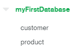
    
    The customer document is created with the @Document annotation in the Customer class, which will be handled by MongoRepository, that extends the CrudRepository interface.
    
    ```java
    @Document
    public class Customer {
    ...
    ```
  
    The product document creation is handled by the CrudRepository.
    
    ```
        public interface ProductRepository extends CrudRepository<Product, Long>
    ```

    The documents are created with the default name of the entity.
    
5. Create two more models (User and Todo) with the following structure:

    User
    ````Javascript
        
        {
            "id": "12354",
            "name": "Charles Darwin",
            "email": "charles@natural.com"
        }
        
     
    ````     
    
    Todo
    ````Javascript
        
        {
            "description": "travel to Galapagos",
            "priority": 10,
            "dueDate": "Jan 10 - 1860"
            "responsible": "charles@natural.com"
            "status": "pending"
        }
    ````                  
    
    
6. Create a repository for the _Users_ using the *CustomerRepository* as reference.

7. Create a repository for the _Todos_ using the *ProductRepository* as reference.

8. Add a *findByResponsible* method to the TodoRepository and verify it works. The method must support pagination

*Note:* You can find more information about Spring Data for Mongo DB [here](https://spring.io/projects/spring-data-mongodb) and some code samples [here](https://github.com/spring-projects/spring-data-book/tree/master/mongodb). 

        ```java
        todoRepository.findByResponsible("david", PageRequest.of(0, Integer.MAX_VALUE)).stream()
                        .forEach(System.out::println);
        ```
        
   The obtained result was the following:
        
   ```text
        [ Description: description, priority: 2, date: date, responsible: david, status: ready ]
        [ Description: description, priority: 2, date: date, responsible: david, status: ready ]
        [ Description: description, priority: 2, date: date, responsible: david, status: ready ]
   ```

## Part 2: Custom configuration and Queries

1. Create a configuration class with the following code:

    ````java

    @Configuration
    public class AppConfiguration {
    
        @Bean
        public MongoDbFactory mongoDbFactory() throws Exception {
    
             MongoClientURI uri = new MongoClientURI(
            "mongodb+srv://sancarbar:<password>@cluster0-dzkk5.mongodb.net/test?retryWrites=true&w=majority");

            MongoClient mongoClient = new MongoClient(uri);

            return new SimpleMongoDbFactory( mongoClient, "test");
    
        }
    
        @Bean
        public MongoTemplate mongoTemplate() throws Exception {
    
            MongoTemplate mongoTemplate = new MongoTemplate(mongoDbFactory());
    
            return mongoTemplate;
    
        }
    
    }
    
    ````

2. Replace the credential values and the server address.

3. Add the following code to your Application run method to access the *MongoTemplate* object:

    ````java
    
        ApplicationContext applicationContext = new AnnotationConfigApplicationContext(AppConfiguration.class);
        MongoOperations mongoOperation = (MongoOperations) applicationContext.getBean("mongoTemplate");
     
    ````     
    
4. The *MongoOperations* instance allows you to create custom queries to access the data by using the *Query* object:
 
    ````java
    
       Query query = new Query();
       query.addCriteria(Criteria.where("firstName").is("Alice"));
    
       Customer customer = mongoOperation.findOne(query, Customer.class);
     
    ````  

5. Read some of the documentation about queries in Spring Data MongoDB:
 
    * https://www.baeldung.com/queries-in-spring-data-mongodb
    * https://www.mkyong.com/mongodb/spring-data-mongodb-query-document/

6. In the *Application* class create mocked data for 25 Todos and 10 different users (make sure the Todos have different dueDates and responsible)

7. Create the following queries using the Query class:

    * Todos where the dueDate has expired
    
        ````java
           expiredDate.addCriteria(Criteria.where("dueDate").lt(new Date()));
        ````
       
       Result: 
       ````
          [ Description: test3, priority: 5, date: Fri Dec 21 00:00:00 COT 2012, responsible: sebastian, status: done ]
          [ Description: test4, priority: 17, date: Fri Dec 21 00:00:00 COT 2012, responsible: alejandro, status: ready ]
          [ Description: test5, priority: 5, date: Sat Dec 21 00:00:00 COT 2013, responsible: sebastian, status: done ]
          [ Description: test6, priority: 1, date: Sun Dec 21 00:00:00 COT 2014, responsible: alejandro, status: ready ]
          [ Description: test7, priority: 0, date: Mon Dec 21 00:00:00 COT 2015, responsible: alejandro, status: on progress ]
          [ Description: test8, priority: 6, date: Wed Dec 21 00:00:00 COT 2016, responsible: alejandro, status: ready ]
          [ Description: test9, priority: 4, date: Thu Dec 21 00:00:00 COT 2017, responsible: juan, status: ready ]
          [ Description: test11, priority: 4, date: Thu Dec 21 00:00:00 COT 2000, responsible: alejandro, status: done ]
          [ Description: 01234567890123456789012345678901234567sss, priority: 1, date: Fri Dec 21 00:00:00 COT 2012, responsible: alejandro, status: ready ]
          [ Description: test13, priority: 6, date: Wed Dec 21 00:00:00 COT 2011, responsible: alejandro, status: on progress ]
          [ Description: test14, priority: 10, date: Fri Dec 21 00:00:00 COT 2012, responsible: alejandro, status: ready ]
          [ Description: test15, priority: 11, date: Sat Dec 21 00:00:00 COT 2013, responsible: alejandro, status: on progress ]
          [ Description: test16, priority: 12, date: Sun Dec 21 00:00:00 COT 2014, responsible: camilo, status: ready ]
          [ Description: 01234567890123456789012345678901234567addadaaa, priority: 1, date: Fri Dec 21 00:00:00 COT 2012, responsible: alejandro, status: on progress ]
          [ Description: 012345sdsdsds67890123456789012345678901234567addadaaa, priority: 1, date: Fri Dec 21 00:00:00 COT 2012, responsible: santiago, status: on progress ]
       ````
        
    * Todos that are assigned to given user and have priority greater equal to 5
    
            ````java
               assignAndPriority.addCriteria(Criteria.where("responsible").is("alejandro").andOperator(
                               Criteria.where("priority").gte(5)
                       ));
            ````
           
           Result: 
           ````
              [ Description: test3, priority: 5, date: Fri Dec 21 00:00:00 COT 2012, responsible: sebastian, status: done ]
              [ Description: test4, priority: 17, date: Fri Dec 21 00:00:00 COT 2012, responsible: alejandro, status: ready ]
              [ Description: test5, priority: 5, date: Sat Dec 21 00:00:00 COT 2013, responsible: sebastian, status: done ]
              [ Description: test6, priority: 1, date: Sun Dec 21 00:00:00 COT 2014, responsible: alejandro, status: ready ]
              [ Description: test7, priority: 0, date: Mon Dec 21 00:00:00 COT 2015, responsible: alejandro, status: on progress ]
              [ Description: test8, priority: 6, date: Wed Dec 21 00:00:00 COT 2016, responsible: alejandro, status: ready ]
              [ Description: test9, priority: 4, date: Thu Dec 21 00:00:00 COT 2017, responsible: juan, status: ready ]
              [ Description: test11, priority: 4, date: Thu Dec 21 00:00:00 COT 2000, responsible: alejandro, status: done ]
              [ Description: 01234567890123456789012345678901234567sss, priority: 1, date: Fri Dec 21 00:00:00 COT 2012, responsible: alejandro, status: ready ]
              [ Description: test13, priority: 6, date: Wed Dec 21 00:00:00 COT 2011, responsible: alejandro, status: on progress ]
              [ Description: test14, priority: 10, date: Fri Dec 21 00:00:00 COT 2012, responsible: alejandro, status: ready ]
              [ Description: test15, priority: 11, date: Sat Dec 21 00:00:00 COT 2013, responsible: alejandro, status: on progress ]
              [ Description: test16, priority: 12, date: Sun Dec 21 00:00:00 COT 2014, responsible: camilo, status: ready ]
              [ Description: 01234567890123456789012345678901234567addadaaa, priority: 1, date: Fri Dec 21 00:00:00 COT 2012, responsible: alejandro, status: on progress ]
              [ Description: 012345sdsdsds67890123456789012345678901234567addadaaa, priority: 1, date: Fri Dec 21 00:00:00 COT 2012, responsible: santiago, status: on progress ]
           ````
   
    * Users that have assigned more than 2 Todos.
   
        ````java
          List<User> users = mongoOperation.findAll(User.class);
          List<User> ans = new ArrayList<User>();
          for(User u: users){
              Query userQuery = new Query();
              userQuery.addCriteria(Criteria.where("responsible").is(u.getName()));
              if(mongoOperation.find(userQuery, Todo.class).size() >= 2){
                  ans.add(u);
              }
          }
          ans.stream().forEach(System.out::println);
        ````
           
        Result: 
        ````
              [ Id: 606f33595e9f8f23ee655cf3, name: alejandro, email: example@example.com ]
              [ Id: 606f335a5e9f8f23ee655cf4, name: juan, email: example@example.com ]
              [ Id: 606f335a5e9f8f23ee655cfa, name: sebastian, email: example@example.com ]
              [ Id: 606f335b5e9f8f23ee655cfc, name: camilo, email: example@example.com ]
       ````

    * Todos that contains a description with a length greater than 30 characters
        ````java
          lengthQuery.addCriteria(Criteria.where("description").regex(".{30}"));
        ````
           
        Result: 
        ````
            [ Description: 012345678901234567890123456789, priority: 1, date: Fri Dec 21 00:00:00 COT 2012, responsible: alejandro, status: ready ]
            [ Description: 01234567890123456789012345678901234567sss, priority: 1, date: Fri Dec 21 00:00:00 COT 2012, responsible: alejandro, status: ready ]
            [ Description: 01234567890123456789012345678901234567addadaaa, priority: 1, date: Fri Dec 21 00:00:00 COT 2012, responsible: alejandro, status: on progress ]
            [ Description: 012345sdsdsds67890123456789012345678901234567addadaaa, priority: 1, date: Fri Dec 21 00:00:00 COT 2012, responsible: santiago, status: on progress ]
        ````  
      

8. Implement the queries of the previous step using *derived query methods* in your repository interface. Is it possible to implement all of them?

    Interfaces:
    
    ````java
    public interface TodoRepository extends CrudRepository<Todo, Long> {
    
        public Page<Todo> findByResponsible(String name, Pageable pageable);
    
        @Query("{ 'dueDate': { $lt : ?0 } }")
        public Page<Todo> findByDateExpired(Date date, Pageable pageable);
    
        @Query("{ 'responsible': ?0 ,  'priority': { $gte : ?1 } }")
        public Page<Todo> findByResponsibleWithMinimunPriority(String responsible, int priority, Pageable pageable);
    
    
        @Query("{ 'description' : { $regex : ?0 } }")
        public Page<Todo> findByDescription(String regex, Pageable pageable);
    }
    ````
    Usage:
  
    ````java
        System.out.println("EXPIRED");
        todoRepository.findByDateExpired(new Date(), PageRequest.of(0, Integer.MAX_VALUE)).stream().forEach(System.out::println);
        
        System.out.println("RESPONSIBLE AND PRIORITY");
        todoRepository.findByResponsibleWithMinimunPriority("sebastian", 5, PageRequest.of(0, Integer.MAX_VALUE)).stream().forEach(System.out::println);
        
        System.out.println("LENGTH");
        todoRepository.findByDescription(".{30}", PageRequest.of(0, Integer.MAX_VALUE)).stream().forEach(System.out::println);
    ````